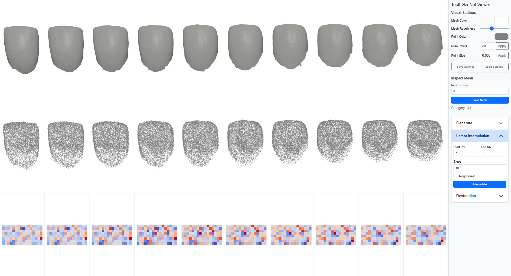
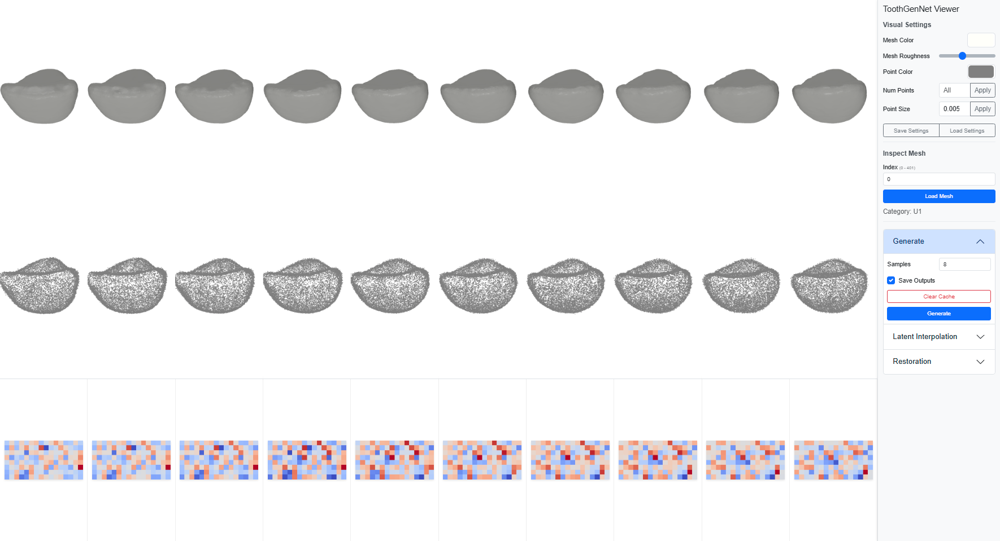
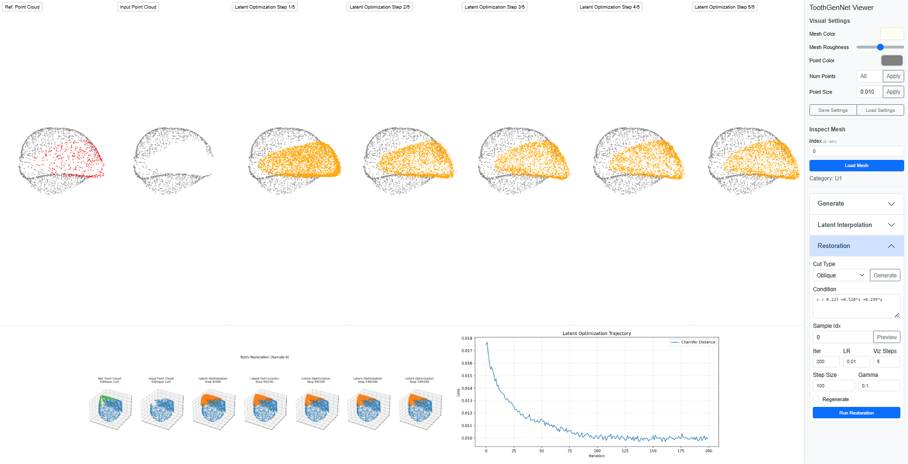
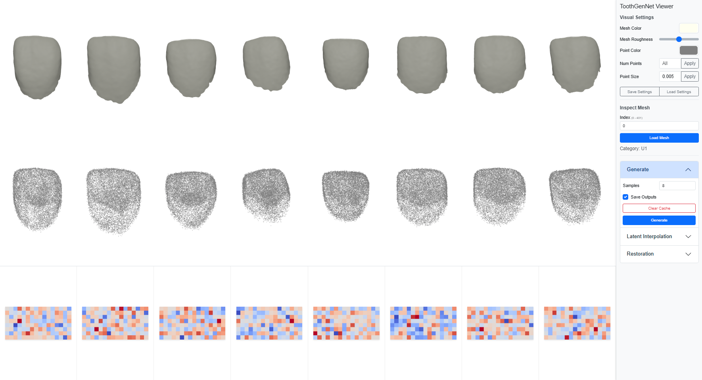
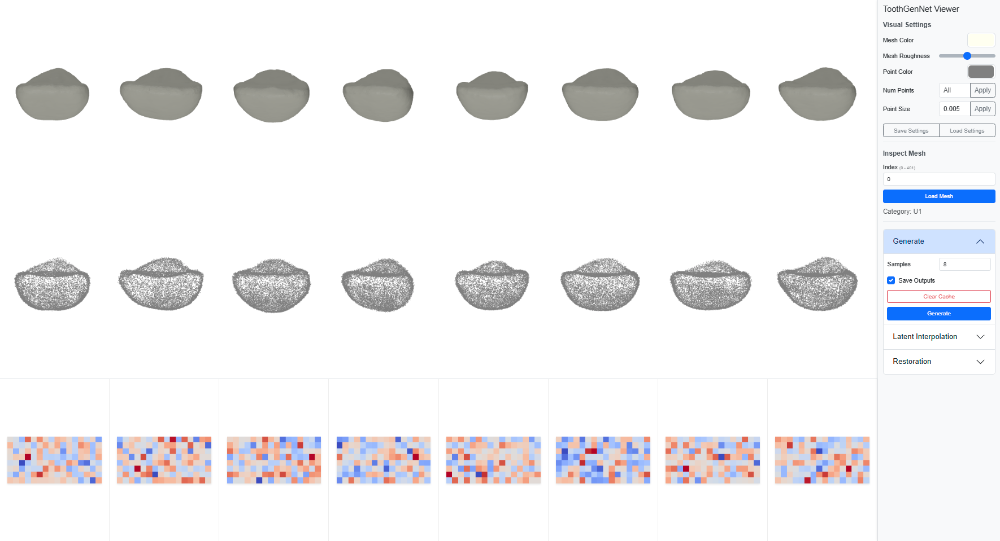

# A Latent Variable Deep Generative Model for 3D Anterior Tooth Shape

**Authors:** Chawalit Chanintonsongkhla, Varin Chouvatut, Chumphol Bunkhumpornpat, Pornpat Theerasopon  
**Journal:** *Journal of Prosthodontics*, 2025  
**DOI:** [10.1111/jopr.14092](https://doi.org/10.1111/jopr.14092)  
**PubMed:** [PMID 40624318](https://pubmed.ncbi.nlm.nih.gov/40624318/)

## Project Structure

```
ToothGenNet_Published/
├── toothgennet/
│   ├── sources/
│   │   ├── metrics/           # Evaluation scripts
│   │   ├── utils/             # Data and model utilities
│   │   ├── visualize/         # Generation and visualization
│   │   └── environment.yml    # Conda environment specification
│   ├── viewer/                # Flask + Three.js web viewer
│   └── modules/               # Metrics packages
│       ├── pytorch_pcd_metrics/
|       └── PointFlow/
├── session_data/              # User data (not tracked)
│   ├── checkpoints/           # Model checkpoints (.pt files)
│   ├── dataset/               # Training/validation datasets (.pkl files)
│   └── generated_priors/      # Pre-generated latent priors (for reproducible evaluation)
├── outputs/                   # Evaluation and generation results
├── run.sh                     # Interactive main script
└── README.md
```

## Quick Start

### 1. Setup Environment

Create and activate the conda environment:

```bash
conda env create -f toothgennet/sources/environment.yml
conda activate gen3d
```

### 2. Build Metrics Packages

The evaluation metrics require building CUDA extensions:

```bash
cd toothgennet/modules/pytorch_pcd_metrics
bash run.sh 2  # Install all PCD metric packages
cd ../../..
```

### 3. Unpack Session Data

Download the required data:
- [session_data.zip](https://drive.google.com/file/d/16NFe7hBqSeXXXbsz3HcTVNnXhJbUh6Cz/view?usp=sharing) - Model checkpoints, datasets, and priors
- [Complete app data](https://drive.google.com/file/d/1gAGdFqJQ4SSaiAzSAhtThruhrX_AlNZC/view?usp=sharing) - Entire application with cloned modules and outputs


```bash
unzip session_data.zip
```

Contents:
- `session_data/checkpoints/*.pt` - Pre-trained model weights
- `session_data/dataset/*.pkl` - Preprocessed tooth point clouds
- `session_data/generated_priors/*.npy` - Fixed priors for reproducible evaluation (seed=2024)

## Usage

### Interactive Mode

Launch the interactive menu:

```bash
./run.sh
```

**Menu Options:**
- **1. Evaluate Checkpoints** - Compute generative metrics on validation set
- **2. Start Flask 3D Viewer** - Launch web interface for visualization and generation
- **3. Exit**

---

## 1. Evaluation: Generative Metrics

```bash
./run.sh
# Select option 1: Evaluate Checkpoints
```

**Metrics computed:**
- `lgan_mmd-CD`, `lgan_cov-CD`, `lgan_mmd_smp-CD`
- `lgan_mmd-EMD`, `lgan_cov-EMD`, `lgan_mmd_smp-EMD`
- `1-NN-CD-acc_t`, `1-NN-CD-acc_f`, `1-NN-CD-acc`
- `1-NN-EMD-acc_t`, `1-NN-EMD-acc_f`, `1-NN-EMD-acc`
- `jsd`

**Output:** `outputs/metrics/`
- `checkpoints_metric_data.csv` - All checkpoints (aggregated)
- `checkpoint-*/evaluate_data.csv` - Per-batch metrics
- `checkpoint-*/generated_samples.npy` - Generated point clouds

---

## 2. Flask 3D Viewer

```bash
./run.sh
# Select option 2: Start Flask 3D Viewer
# Open browser: http://localhost:5000
```

**Functionalities:**

1. **Inspect Mesh** - Visualize dataset samples
   - Output: Browser display

2. **Generate Samples** - Generate new tooth shapes
   - Output: `outputs/generation/<md5_hash>/`

3. **Interpolate** - W-space interpolation between two samples
   - Output: `outputs/latent_interpolation/<md5_hash>/`

4. **Restore Damaged Tooth** - Simulate damage and restore via latent optimization
   - Cut types: horizontal, oblique, split
   - Output: `outputs/restoration/<md5_hash>/`

---

## Citation

```bibtex
@article{Chanintonsongkhla2025PointFlow,
  title     = {A Latent Variable Deep Generative Model for 3D Anterior Tooth Shape},
  author    = {Chanintonsongkhla, Chawalit and Chouvatut, Varin and Bunkhumpornpat, Chumphol and Theerasopon, Pornpat},
  journal   = {Journal of Prosthodontics},
  year      = {2025},
  doi       = {10.1111/jopr.14092}
}
```

## License

See LICENSE file for details.

## Contact

For questions or issues, please open an issue on GitHub or contact the authors.

---

## Examples

### Latent Interpolation



### Tooth Restoration



### Generated Samples


